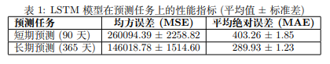
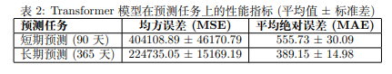
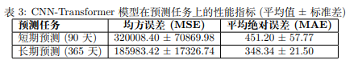

# A Project For ML-Course 
## 项目简介
该项目为苏州大学2025春机器学习课程大作业，研究的目标是根据最近的电力消耗情况，预测接下来的预期电力消耗，具体为对未来每一天的总有功功率进行预测。实现了LSTM, Transformer, CNNTransformer 三种模型分别进行长短期预测。
## 模型介绍
我们提出了一种新颖的混合模型架构。该模型的核心思想是：利用一维卷积神经网络（1D-CNN）高效地提取时间序列中的局部特征和短期模式，然后将这些信息更丰富的特征序列输入到 Transformer 编码器中，以建立长期依赖关系模型。这种分工明确的层次化结构，旨在更全面、更深刻地理解复杂的电力消耗数据。
## 数据集
针对 UCI 机器学习库公开的“Individual household electric power consumption”数据集进行预测分析 https://archive.ics.uci.edu/dataset/235/individual+household+electric+power+consumption \
天 气 信 息 可 在 下 述 网 站 获 取 ：
https://www.data.gouv.fr/fr/datasets/donnees-climatologiques-de-base-mensuelles。
## 项目结构
```
MLpro2025Spring/
├── dataset
│  └── process_data.py # 数据预处理文件
│  └── train.csv # 训练数据
│  └── test.csv # 测试数据
├── models
│  └── LSTM.py #模型文件
│  └── model_info.txt #模型结构输出文件
│  │ ....
├── output
│  ├── lstm_results_90 # 记录LSTM预测90天的结果
│  │  ├── 20250713_182633 # 单次运行结果
│  │  │  ├── runs
│  │  │  │  └── loss_curve.png # 训练损失图
│  │  │  │  └── events.out.tfevents.1752402393.soft-8V100.4121635.0 # tensorboard文件
│  │  │  └── Log.log # 运行日志
│  │  │  └── lstm_plot_90.png # 预测值与实际值对比图
│  │  │  └── lstm_results_90.csv # 预测值与实际值数据
│  │  └── evaluation_metrics.csv # LSTM预测90天的评估结果
│  │  │ ....
│  │ ....
├── scripts # 脚本
│  └── train_lstm.bash # 训练LSTM模型
│  └── eval_lstm.bash # 评估LSTM模型
│  └── calmean_std.bash # 计算多次结果的mean和std
│  │ ....
├── weight # 权重
│  └── lstm_best_model_90.pth # LSTM预测90天模型权重
│  │ ....
└── config.py # 配置
└── mean_std.py # 计算mean和std
└── params.py # 计算模型参数量
└── README.md
└── requirements.txt
└── train.py # 训练
└── utils.py 
```
## 使用说明
创建环境
```bash
conda create -n mlpro python=3.9
conda activate mlpro
cd ./MLpro2025Spring
pip install -r requirements.txt
```
数据处理
```bash
python process_data.py
```
模型训练
```bash
bash ./scripts/train_lstm.bash # trans, ours同理
```
## 实验结果


